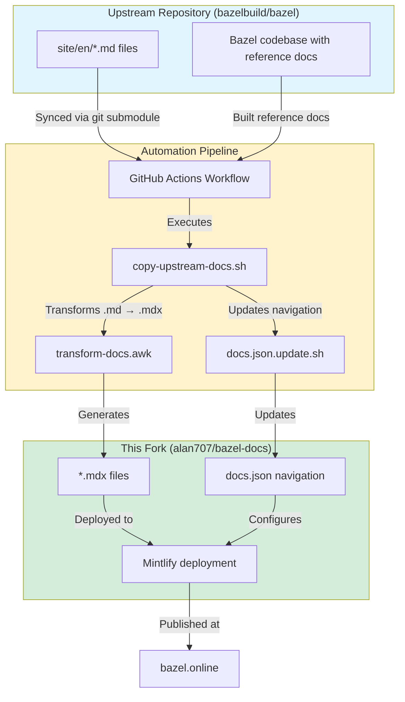

Documentation for bazel.online syncs automatically from the upstream Bazel repository (bazel.build) and transforms it for display on this site.

## Architecture overview

## The documentation flow

### Upstream source (bazel.build)

The canonical source for Bazel documentation lives in the [bazelbuild/bazel](https://github.com/bazelbuild/bazel) repository:

- **Narrative documentation**: `.md` files in the `site/en/` directory
- **Reference documentation**: Generated from code comments in the Bazel codebase

Make changes to the upstream Bazel repository, not to this fork directly.

### Automated synchronization

A GitHub Actions workflow (`.github/workflows/pull-from-bazel-build.yml`) syncs the upstream repository periodically:

- Initializes the `upstream` git submodule pointing to bazelbuild/bazel
- Builds reference documentation from the Bazel codebase
- Runs `copy-upstream-docs.sh` to copy and transform files
- Uses `transform-docs.awk` to convert `.md` files to Mintlify-compatible `.mdx` format
- Updates `docs.json` with versioned navigation structures
- Commits and pushes changes to this repository

**When it runs:**
- Automatically when Dependabot updates the upstream submodule
- Manually via workflow dispatch
- On pull requests to preview changes

### Documentation transformation

The transformation process adapts upstream documentation for Mintlify:

**File conversion (`.md` → `.mdx`):**
- Converts HTML tags to Mintlify components
- Transforms anchor references (underscores to dashes)
- Adds frontmatter for Mintlify
- Preserves code examples and syntax highlighting

**Navigation structure:**
- Upstream uses `_index.yaml` files for navigation
- This fork uses `docs.json` (Mintlify format)
- Navigation changes must be manually applied to maintain consistency

### Preview and deployment (bazel.online)

Once changes merge into this repository:

- **Preview**: Pull requests generate preview deployments via Mintlify automatically
- **Production**: Merges to `main` deploy to bazel.online
- **Versioned docs**: Multiple Bazel versions are maintained (6.5.0, 7.6.1, 8.x.x, etc.)

## Contributing documentation

### Making changes

**For narrative documentation:**

1. Make your changes in the [bazelbuild/bazel](https://github.com/bazelbuild/bazel) repository
2. Edit files in the `site/en/` directory
3. Create a pull request following the upstream contribution guidelines
4. Once merged, your changes sync to bazel.online automatically

**For reference documentation:**

1. Update code comments in the relevant Bazel source files
2. The build process extracts and formats the documentation automatically

### Local-only files

Some files live only in this repository and don't sync from upstream:

- `index.mdx` (homepage)
- `docs.json` (navigation configuration)
- Files listed in the `LOCAL_FILES` variable in `copy-upstream-docs.sh`

Make changes to these files directly in this repository.

## Seeing your changes

### During development

**Upstream PR preview:**
- When you create a PR in bazelbuild/bazel, changes don't appear on bazel.online yet
- Review the Markdown files in the GitHub PR interface
- Ensure your documentation follows Markdown best practices

**This repository preview:**
- After your upstream changes sync here, a PR is created automatically
- Mintlify generates a preview deployment for the PR
- You can review the rendered documentation on bazel.online's preview URL

### After merging

**Timeline:**
1. Your PR merges to bazelbuild/bazel (bazel.build)
2. Dependabot detects the upstream changes (runs periodically)
3. Automation creates a PR in this repository
4. After review and merge, changes deploy to bazel.online (typically within minutes)

**Verification:**
- Visit [bazel.online](https://bazel.online) to see your published changes
- Check both current version and versioned documentation paths
- Use the site search to find your updated content

## Troubleshooting

### My upstream PR merged but I don't see it on bazel.online

The sync process runs periodically via Dependabot. It may take time for:
- Dependabot to detect upstream changes
- The sync PR to be created and reviewed
- The changes to be merged and deployed

### The documentation looks different on bazel.online

The transformation process converts Markdown to Mintlify-flavored MDX. Some differences are expected:
- HTML tags convert to Mintlify components (for example, `<aside>` → `<Note>`)
- Navigation structure adapts to Mintlify's format
- Anchors use dashes instead of underscores

If something looks broken, file an issue in this repository.

### I need to fix something urgently

For urgent fixes to bazel.online:
1. Create a PR directly in this repository (alan707/bazel-docs)
2. Your changes may be overwritten on the next upstream sync
3. Make the same changes upstream to preserve them long-term

## Contributing to this pipeline

To improve the documentation pipeline itself:

- **Transformation logic**: Edit `transform-docs.awk`
- **Copy process**: Modify `copy-upstream-docs.sh`
- **Automation workflow**: Update `.github/workflows/pull-from-bazel-build.yml`
- **Navigation structure**: Edit `docs.json`

Test all changes carefully to avoid breaking the automatic sync process.

## Questions or issues?

- **Upstream documentation issues**: File in [bazelbuild/bazel](https://github.com/bazelbuild/bazel/issues)
- **bazel.online specific issues**: File in [alan707/bazel-docs](https://github.com/alan707/bazel-docs/issues)
- **General help**: Join the [Bazel Slack](https://slack.bazel.build) and ask in #documentation
